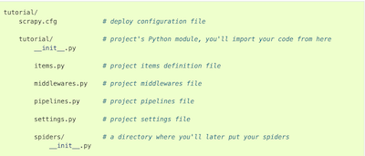
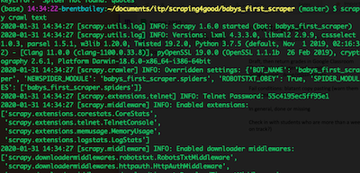
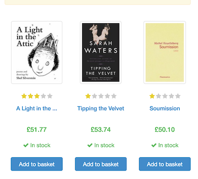
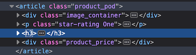
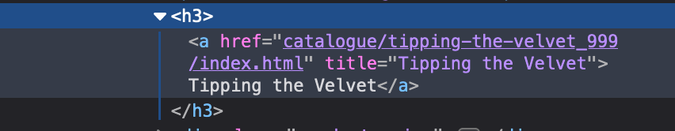
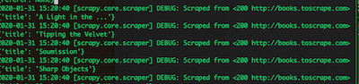

# Web Scraping For Better Datasets

To get the most out of this workshop, you’ll need to have [python](https://www.python.org/downloads/) and [scrapy](https://scrapy.org/) installed. If you haven’t used python before, we’re going to start with the simplest possible applications of it, so you should be able to follow along. If this ends up sparking your fancy, there are tons of resources available online, some of my favorites of which are linked on the workshop’s [are.na](https://www.are.na/brent-bailey/web-scraping-4-social-good).

Since there are likely a variety of skill levels in this group, fair warning: if you’re not familiar with the command line, some of the stuff in the practical portion of this workshop may be harder to follow, but you should be able to follow along by copying and pasting, and I’ll explain what’s happening at every step.

## What’s web scraping?

Simply put, it’s gathering and extracting data from a website or websites. If you’ve ever saved a meme from a website or copied and pasted text from an article, congrats! You’re a web scraper.

Generally, however, what people mean when they talk about web scraping is the automation of this process. Rather than manually searching flickr for pictures of trees and downloading them one by one, automated web scraping allows us to download every picture of a tree on flickr in a short amount of time by executing simple scripts or using software.

## What tools can we use to scrape data?


There are a whole lot of them, and you can also write your own! We’re going to focus primarily on scraping with Python, so here are a few of the most popular scraping tools.

[Scrapy](https://scrapy.org/): Python. High level, easy to use. Sometimes needs to be used with Selenium or Beautiful Soup for websites with a lot of dynamic content.
Good for crawling websites - visiting multiple pages in a single session. Extremely fast and extensible.

[Beautiful Soup](https://www.crummy.com/software/BeautifulSoup/): Python. The OG scraper, old, good for parsing HTML, lower level.

[Selenium](https://github.com/SeleniumHQ/selenium): APIs for a number of languages. Often used for web automation or testing. Works well with JavaScript and dynamic content - better at mimicking the way we actually interact with websites.

## Let’s write a scraper!

If you haven’t already, let’s install Scrapy. You can do this easily in the terminal with ```pip install scrapy```.

Once scrapy is installed, we can create an empty project folder for our scraper:
``` scrapy startproject babys_first_scraper```

This will create a folder called “babys_first_scraper”. if you enter the folder, it should contain a structure like this:


Now let’s start actually writing our scraper!

Go to the `spiders` directory within the `babys_first_scraper` folder:

```cd babys_first_scraper/spiders``` and create a spider file: ```touch text_spider.py```.

### Wait, what’s a spider?

A spider, also often called a web crawler, is a bot that automatically browses websites. This is how Google gets its search results, and also the primary method for most web scrapers of accessing the internet: rather than creating a spider for the entire world wide web, like google, we automate the process of visiting a single website or a few websites, then within the spider we can specify the data we want and download it.

### Back to making the spider

In your text editor of choice, open `text_spider.py`. We’ll start by telling it what website to visit: in this case, we’ll be using [books.toscrape.com](http://books.toscrape.com), a prebuilt website intended for people to test their scrapers on.

First, in the `text_spider.py` file, enter:

```
import scrapy

class TextSpider(scrapy.Spider):
  name=”text”
```

This tells the script to use Scrapy’s prebuilt Spider class, so we don’t have to deal with writing our own basic spider code. We then name the spider “text” since that’s what we’re focused on getting right now.

Now, below `name=”text”`, enter:

```
  def start_requests(self):

    #tell it which website(s) to visit
    urls=[
      ‘http://books.toscrape.com’]
    #visit each url
    for url in urls:
      #at each url, run the ‘parse’ function
      yield scrapy.Request(url=url, callback=self.parse)

  def parse(self, response):
    #set a filename to write the response to
    filename = ‘books.html’
    with open(filename, ‘wb’) as f:
      f.write(response.body)
    self.log(‘Saved file %s’ % filename)
```

We now have the simplest possible spider, so let’s run it!

Go to the root folder in the terminal and run

`scrapy crawl text`

If everything in your script is correct, you should see something like this:



And when your script is finished running, there should now be a `books.html` file in your root folder.

If you open this in the browser, you’ll see a bunch of unstyled HTML. Not super useful - we could just have used  `wget` for that.

So let’s start taking advantage of the power of Scrapy in earnest!

### Parsing HTML

Where Scrapy really starts to become useful is when we start to parse the raw HTML of the pages Scrapy visits. On books.toscrape.com, for example, each book item we see:



is represented in the page’s HTML by an `<article>` object like this:



#### A quick aside: If you want to be an *elite hacker*, Scrapy has a command line tool for exploring html, [Scrapy shell](https://docs.scrapy.org/en/latest/topics/shell.html#topics-shell). We don’t have time to cover it here, but it’s a useful tool if you’re more comfortable in the terminal.

In this example, if we dig into the HTML further, we’ll find that the book title is contained inside the `<h3>` object:



So, if we want to get the title of every book on the page, we need to tell Scrapy to go get it from inside that `<h3>`.

Let’s go back to `text_scraper.py`

For now, we can remove the old code under our `parse` function, and instead tell Scrapy to extract data from the page’s HTML:

```

def parse(self, response):
      #as we can see in the page’s HTML, each book is contained in an <article> with the class ‘product_pod’, so we’ll tell Scrapy to start there

      for book in response.css(‘article.product_pod’):
        yield {
          ‘title’: book.css(‘h3.text::text’).get()
        }

```

If we run our scraper again, we should see it output some book titles:



Now we’re getting somewhere! But if we want to actually store this data, we’ll need to tell Scrapy to keep it. This is super simple for basic JSON objects, just run:
`scrapy crawl text -o titles.json`
and it should write a JSON file to your folder containing all the objects. JSON not useful for your project? [Scrapy’s feed exports](https://docs.scrapy.org/en/latest/topics/feed-exports.html#topics-feed-exports) include CSV and XML as well.

### Do It Yourself

Now try getting the price or star rating from the `<article>` object and writing it to a JSON file.

### Downloading Images

But what if we want to download the book covers for our fancy new GAN, or for our Instagram that for some reason posts just pictures of book covers?

First of all, if you don’t already have it, you’ll need to install Pillow: `pip install Pillow`

To get images, we’ll need to add a line to our settings file that tells Scrapy that we want to actually download files. If you’re downloading hundreds or thousands of images, you may want to write them to some form of cloud storage - more information on that [here](https://docs.scrapy.org/en/latest/topics/media-pipeline.html).

Open the `settings.py` file, uncomment lines 67 through 69, and change it to the following:

```
# Configure item pipelines
# See https://doc.scrapy.org/en/latest/topics/item-pipeline.html
ITEM_PIPELINES = {
    'scrapy.pipelines.images.ImagesPipeline': 1,
}


```

Now, at the bottom of the settings file, add a line with a filepath to where you want to store the images - we’ll just use a folder named `images`:
```
#HTTPCACHE_STORAGE = 'scrapy.extensions.httpcache.FilesystemCacheStorage'
IMAGES_STORE=  ‘./images/’
```

Now let’s go to the `spiders` folder and create a new file called `image_spider.py`. Open the file and copy in this basic code:

```
import scrapy

class ImageSpider(scrapy.Spider):
  name=”image”

  # this is a simpler way of using Scrapy’s default settings for crawling URLs - we don’t have to use the start_requests function unless we want to use custom code.
  start_urls = [‘https://books.toscrape.com’]

  def parse(self, response):
    # set an empty ‘dict’ to contain our images
    books = dict()
    #create an array of image URLs to get from the HTML
    image_urls = []

    for book in response.css(‘article.product_pod’):
      #get the absolute link to the image by joining it to the URL of the website
          image_urls.append(response.urljoin(book.css('div.image_container a img.thumbnail::attr(src)').get()))
      #add these URLs to our books object
        books['image_urls'] = image_urls
      # tell Scrapy to download the images to the folder we designated in settings
        yield books
```

Now, if we run our image scraper: `scrapy crawl images`

Once it finishes downloading, we should be able to enter the `images/full` folder and see all the images we downloaded!


## More useful stuff

[A bunch of links I’ve collected](https://www.are.na/brent-bailey/web-scraping-4-social-good): This is a general storage place for scraping-related content that I put together - covers both the broader environment around web scraping and more specific tools and tutorials.

[Using Scrapy with XPath](https://docs.scrapy.org/en/latest/topics/selectors.html#topics-selectors) : XPath is a more powerful way of scraping pages by searching for content that’s not just CSS.
